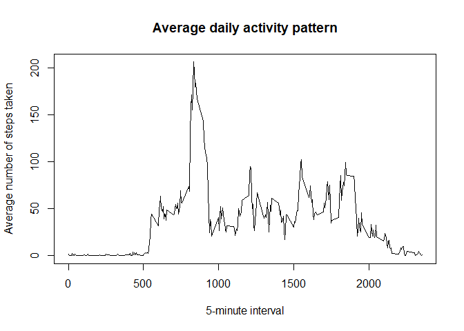

## Loading and preprocessing the data

First, let's load the data.


```r
unzip("activity.zip")
activity <- read.csv("activity.csv")
file.remove("activity.csv")
```

Now we can preprocess the data: we convert dates to a better format.


```r
activity$date <- as.Date(activity$date)
```

Then we take a look at the data.


```r
head(activity)
```

```
##   steps       date interval
## 1    NA 2012-10-01        0
## 2    NA 2012-10-01        5
## 3    NA 2012-10-01       10
## 4    NA 2012-10-01       15
## 5    NA 2012-10-01       20
## 6    NA 2012-10-01       25
```

```r
str(activity)
```

```
## 'data.frame':	17568 obs. of  3 variables:
##  $ steps   : int  NA NA NA NA NA NA NA NA NA NA ...
##  $ date    : Date, format: "2012-10-01" "2012-10-01" ...
##  $ interval: int  0 5 10 15 20 25 30 35 40 45 ...
```

## What is mean total number of steps taken per day?

Here we remove missing values and make a histogram to represent the total number of steps taken each day.


```r
library(dplyr)
activity_nona <- na.omit(activity)
total_nona <- summarize(group_by(activity_nona, date), amount = sum(steps))
hist(total_nona$amount, main = "Histogram of the total number of steps taken each day", xlab = "Number of steps")
```

<!-- -->

After that, we compute the mean and median of the total number of steps taken per day.


```r
mean(total_nona$amount)
```

```
## [1] 10766.19
```

```r
median(total_nona$amount)
```

```
## [1] 10765
```

## What is the average daily activity pattern?

With this code we plot the average number of steps taken along each 5-minute interval.
This allows us to have an idea of the average daily activity pattern.


```r
intervals <- summarize(group_by(activity_nona, interval), amount = mean(steps))
plot(intervals$interval, intervals$amount, type = "l",
     main = "Average daily activity pattern", xlab = "5-minute interval", ylab = "Average number of steps taken")
```

<!-- -->

From there, we can find which 5-minute interval contains the maximum number of steps on average.


```r
filter(intervals, amount == max(amount))
```

```
## # A tibble: 1 x 2
##   interval amount
##      <int>  <dbl>
## 1      835   206.
```

## Imputing missing values

We calculate the total number of missing values in the dataset.


```r
sum(is.na(activity))
```

```
## [1] 2304
```

In this part, we decide to replace missing values with the mean of the corresponding 5-minute interval across all days.
We then make a histogram and calculate the mean and median in the same way as above.


```r
activity_fill <- mutate(activity, steps = ifelse(is.na(steps), as.integer(filter(intervals, interval == interval)$amount), steps))
total_fill <- summarize(group_by(activity_fill, date), amount = sum(steps))
hist(total_fill$amount, main = "Histogram of the total number of steps taken each day", xlab = "Number of steps")
```

<!-- -->

```r
mean(total_fill$amount)
```

```
## [1] 10749.77
```

```r
median(total_fill$amount)
```

```
## [1] 10641
```

The mean and median are relatively close to previous estimates.
I decided to take the whole part of the mean for each interval to replace the missing values (count full steps).
As a consequence, these values are a bit smaller than the previous ones.
On the graph, we notice that the days frequency increased significantly in the middle range (near the mean).
So the impact of imputing missing data is the increase of frequency near the mean.

## Are there differences in activity patterns between weekdays and weekends?

Finally, we split the dataset in two parts: weekday and weekend days.
It allows us to compare the activity patterns between weekdays and weekends.


```r
library(lattice)
activity_fill <- mutate(activity_fill, dayType = factor(grepl("(samedi|dimanche)", # french weekend days
                                                    weekdays(as.Date(date))),
                                              labels = c("weekday", "weekend")))
intervals_fill <- summarize(group_by(activity_fill, interval, dayType), amount = mean(steps))
xyplot(amount ~ interval | dayType, groups = dayType, data = intervals_fill, type = "l", layout = c(1, 2),
       main = "Activity pattern comparision between weekdays and weekends",
       xlab = "5-minute interval", ylab = "Average number of steps taken")
```

<!-- -->

We can see that the individual tends to wake up earlier in weekdays (more steps at the beginning of the day).
During weekends, the individual seems to walk more and more regularly.
A significant peak can be seen around interval 850 for weekdays, it is less pronounced for weekends.
To finish with, he goes to bed sooner in weekdays (less steps at the end of the day).
